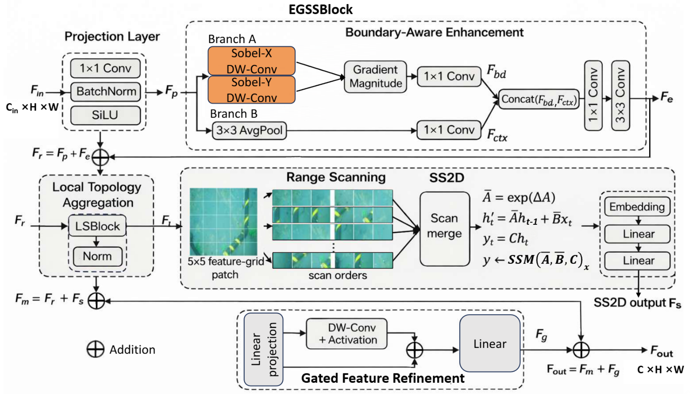

# SCMamba-YOLO
[IcaMal2026]

SCMamba-YOLO is an object detection codebase for underwater submarine cable perception, built on Ultralytics and selective scan operators. The repository provides standard SCMamba-YOLO configs and enhancement-enabled variants that place an image enhancement front-end before the detector backbone.



## Environment Setup

```bash
git clone <your-repo-url>
cd SCMamba-YOLO

conda create -n scmambayolo python=3.11 -y
conda activate scmambayolo

pip install torch torchvision torchaudio
pip install seaborn thop timm einops

cd selective_scan
pip install .
cd ..

pip install -v -e .
```

## Dataset Format

Training follows the standard Ultralytics dataset-yaml format:

```yaml
path: /path/to/your/dataset
train: images/train
val: images/val
test: images/test

names:
  0: cable
```

Typical folder structure:

```text
dataset/
├── images/
│   ├── train/
│   ├── val/
│   └── test/
└── labels/
    ├── train/
    ├── val/
    └── test/
```

## Model Configs

All model yaml files are under:

```text
ultralytics/cfg/models/scmamba-yolo/
```

Available variants:

- `SCMamba-YOLO-T.yaml`
- `SCMamba-YOLO-B.yaml`
- `SCMamba-YOLO-L.yaml`
- `SCMamba-YOLO-T-Enhance.yaml`
- `SCMamba-YOLO-B-Enhance.yaml`
- `SCMamba-YOLO-L-Enhance.yaml`

## Quick Start

### Train the standard detector

```bash
python train.py \
  --task train \
  --data /path/to/your_dataset.yaml \
  --config ultralytics/cfg/models/scmamba-yolo/SCMamba-YOLO-T.yaml \
  --imgsz 640 \
  --epochs 400 \
  --batch_size 16 \
  --device 0
```

### Train with the enhancement front-end

```bash
python train.py \
  --task train \
  --data /path/to/your_dataset.yaml \
  --config ultralytics/cfg/models/scmamba-yolo/SCMamba-YOLO-T-Enhance.yaml \
  --enhance_weights /path/to/interactnet.pth \
  --enhance_freeze \
  --imgsz 640 \
  --epochs 400 \
  --batch_size 16 \
  --device 0
```

### Validate a trained checkpoint

```bash
python val.py \
  --weights /path/to/best.pt \
  --data /path/to/your_dataset.yaml \
  --split test \
  --imgsz 640 \
  --batch 4 \
  --device 0
```

## Notes

- Use `SCMamba-YOLO-*-Enhance.yaml` only when you have a pretrained InteractNet enhancement checkpoint.
- For the released `train.py`, enhancement-enabled configs require `--enhance_weights`. If it is missing, the script will stop and print instructions for obtaining enhancement weights through `Enhancement-main/src/train.py`.
- The enhancement module can still be instantiated without weights for architecture inspection or local debugging, but random initialization is not intended for official results.
- Freezing layers does not reduce the total parameter count; it only reduces the number of trainable parameters during optimization.
- `val.py` writes a summary file to `runs/val/<exp_name>/paper_data.txt`.
- For Mamba-based configs, install `selective_scan` correctly before training or evaluation.

## Acknowledgements

This project is built on top of:

- [Ultralytics](https://github.com/ultralytics/ultralytics)
- selective scan operators from the VMamba ecosystem
